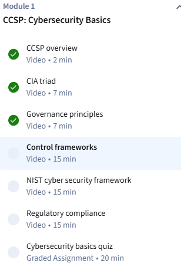
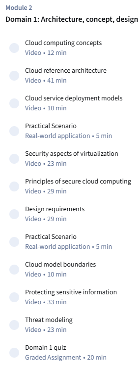
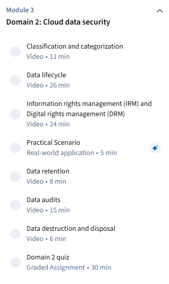
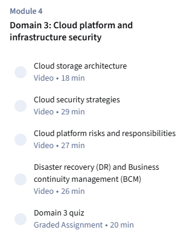
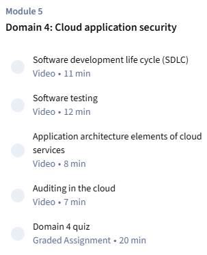
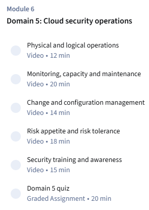
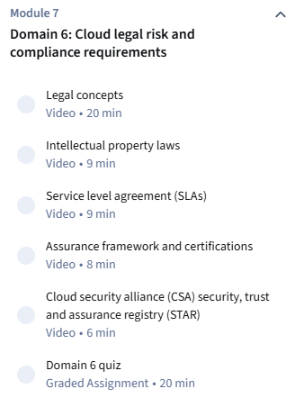

# Projektbeschrieb – Certified Cloud Security Professional (CCSP)

> **Kurs:** Certified Cloud Security Professional (CCSP)  
> **Anbieter:** Infosec / Coursera  
> **Zeitraum:** 1. Juni – 6. Juli 2026

---

## 1. Eckdaten

| Feld | Details |
|------|---------|
| **Kursname** | Certified Cloud Security Professional (CCSP) |
| **Anbieter** | Infosec / Coursera |
| **Kurstyp** | Online-Kurs mit Zertifikat (Intermediate Level) |
| **Sprache** | Englisch |
| **Start** | 1. Juni 2026 |
| **Geplantes Ende** | 6. Juli 2026 |
| **Gesamtdauer** | 5 Wochen (ca. 4 Stunden pro Tag/Woche) |
| **Lernmodus** | Flexibel, selbstorganisiert |
| **Abschluss** | Coursera-Zertifikat nach bestandenen 8 Assessments |

---

## 2. Kursbeschreibung

Der Kurs *Certified Cloud Security Professional (CCSP)* von Infosec auf Coursera ist eine intensive Vorbereitung auf die CCSP-Zertifizierungsprüfung von (ISC)². Er deckt das gesamte Common Body of Knowledge (CBK) mit 6 Kerndomänen ab und vermittelt praxisnahe Kenntnisse in Cloud-Sicherheit, Datenschutz, Infrastruktur und rechtlicher Compliance.

Der Kurs richtet sich an IT-Fachkräfte mit Erfahrung, die ihre Kenntnisse im Bereich Cloud Security systematisch vertiefen und für eine international anerkannte Zertifizierung qualifizieren möchten.

---

## 3. Zeitplan (5 Wochen)

| Woche | Zeitraum | Thema / Inhalt |
|-------|----------|----------------|
| Woche 1 | 01.06. – 07.06.2026 | Cybersecurity-Grundlagen & Domäne 1 (Module 1 & 2): Cloud-Konzepte, Architektur & Design |
| Woche 2 | 08.06. – 14.06.2026 | Domäne 2 (Module 3): Cloud-Datensicherheit & Domäne 3 (Module 4): Cloud-Plattform & Infrastruktur |
| Woche 3 | 15.06. – 21.06.2026 | Domäne 4 (Module 5): Cloud-Anwendungssicherheit |
| Woche 4 | 22.06. – 28.06.2026 | Domäne 5 (Module 6): Cloud-Sicherheitsbetrieb |
| Woche 5 | 29.06. – 05.07.2026 | Domäne 6 (Module 7): Rechtliche & Compliance-Aspekte |
| Woche 6 | 06.07.2026 | Domäne 6 (Module 7) Abschluss|

---

## 4. Kurs-Features & Leistungsnachweis

| Feature | Details |
|---------|---------|
| 8 Module | CCSP CBK-Grundlagen bis Praxisszenarien |
| 8 Assessments | Prüfungsaufgaben nach jedem Modul |
| Flexibler Zeitplan | Lernen im eigenen Tempo |
| Praxisnahe Q&A-Szenarien | Realitätsnahe Prüfungsszenarien |
| Coursera-Zertifikat | Teilbares Zertifikat für LinkedIn & Lebenslauf |
| Sprache | Englisch |
| Bewertung | ⭐ 4.7 / 5.0 (307 Bewertungen) |
| Niveau | Intermediate |

### Module 1

### Module 2

### Module 3

### Module 4

### Module 5

### Module 6

### Module 7

---

## 5. Arbeitsjournal

| Tag | Zeit | Was habe ich gemacht? | Zusammenfassung | Bemerkungen |
|---|---|---|---|---|
| 01.06.2026 | 3h (4 Lektionen) | Module 1 Abgeschlossen | Modul 1 umfasst die Grundlagen zu Cybersecurity, insbesondere die regulatorischen und rechtlichen Aspekte. Es stellt mehrere Cybersecurity Frameworks vor und wie sie anzuwenden sind. | |
| 08.06.2026 | 3h (4 Lektionen) | Module 2 (50%) | Module 2 geht etwas tiefer in den Aspekt von Security in der Cloud hinein. | Modul 2 ist um einiges umfangreicher als die folgenden Module, was ich beim Projektbeschrieb nicht miteingezogen hatte. Das erklärt den verschobenen Fortschritt. |
| 15.06.2026 | 3h (4 Lektionen) | Module 2 (100%) & Module 3 (~80%) | Modul 3 verschärft sich tiefer in den Aspekt "Cloud Data Security", worin es hauptsächlich um Klassifizierung, Speicher und den Lifecycle ging. | Modul 3 ging um einiges schneller vorbei als das lezte Modul. |

## 6. Zusammenfassungen Module

### Modul 1 (CCSP: Cybersecurity Basics)
Modul 1 beinhaltet die wesentliche Cybersecurity Basics wie das CIA-Triad (Confidentiality, Integrity, Availability), IT-Governance, Sicherheitsframeworks wie ISO 27001 und COBIT, das Framework NIST und die Kern-Funktionen (Identify, Protect, Detect, Respond Recover) und die regulatorischen und rechtlichen Anforderungen wie das DSGVO und HIPAA und deren Bedeutungen für Cloud-Environments. Am Ende dieser Abschnitte gab es eine prüfungsähnliche Abfrage, um mein Wissen zu testen und anzuwenden. Ich konnte mit 90% abschliessen.

### Modul 2 (Domain 1: Architecture, concept, design)
Modul 2 umfasst einiges Mehr als das Vorherige. Anfangs befasst es sich mit den Kernbegriffen wie Customer, Vendor und Partner und wie sie in der Cloud-Umgebung eine Rolle spielen. Dazu umfasst es auch die Grundlagen zu den Cloud-Architekturen und Servicemodelle wie IaaS, PaaS und SaaS. Dazu wird auch schwer die Virtualisierungssicherheit (z.B. Virtual Machines und Hypervisor-Typen) sowie das Shared Responsibility Model behandelt. Gegen den Schluss wird über Threat Modelling gesprochen und um mein Wissen zu testen, habe ich eine Prüfung zu diesem Modul geschrieben.

### Modul 3 (Domain 2: Cloud Data Security)
Es behandelt den sicheren Umgang mit Daten über den gesamten Lebenszyklus (Create, Store, Use, Share, Archive, Destroy). Schwerpunkte sind Klassifikation und Kategorisierung von Daten, Verschlüsselung (at rest, in transit, in use), Key Management sowie andere Methoden wie Masking, Tokenization und Anonymization.